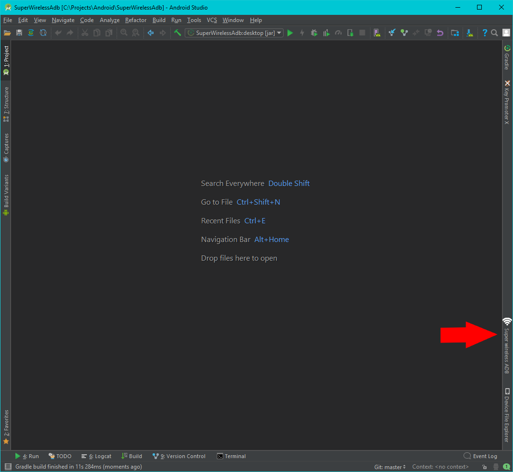
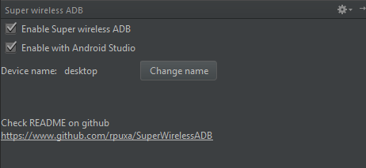
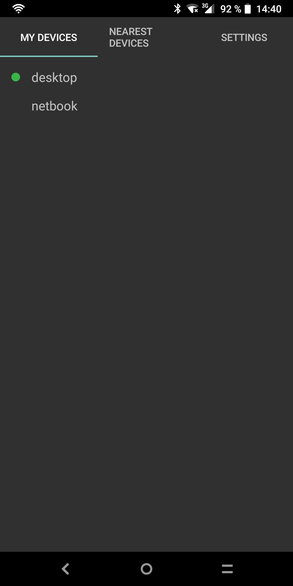
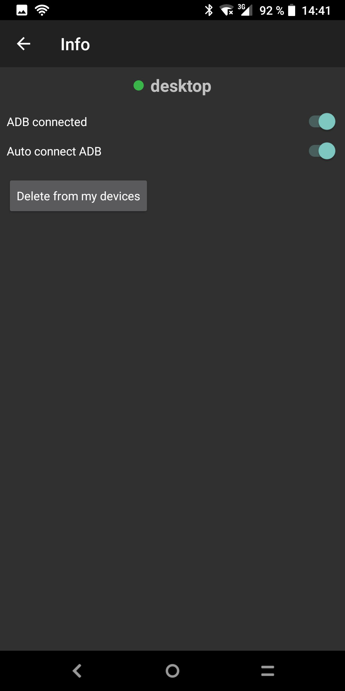

# Super wireless ADB

Super wireless ADB - plugin that helps you to connect ADB via WiFi absolutely without USB cable!
Even at first connection plugin does not require USB, all you need is connect PC and android device to the same Wifi network!

## Plugin
### Installation
Download from [github](https://github.com/rpuxa/SuperWirelessAdb/tree/master/DOWNLOAD) 
***or*** 
Install in Android Studio -> Settings -> Plugins -> Browse repositories -> Super wireless ADB
### Usage
**Enable Super wireless ADB** - enable visibility. Now you can detect this pc on your android device 
**Enable with Android Studio** - enable visibility when starting Android Studio 
**Name** - Name that will be displayed in the device list  
  

## Android
### Installation
Download from [github](https://github.com/rpuxa/SuperWirelessAdb/tree/master/DOWNLOAD)
### Usage
1. Connect PC and phone to the same WiFi network
2. Open **Nearest devices** tab and add your PC to **My devices**
3. In **My devices** tab click to you PC
4. Now you can connect ADB or enable auto connect ADB (device will connect ADB when PC is detected). You can also connect ADB using notification  
      

## Contacts
E-mail: gr0070@mail.ru 
[Github](https://github.com/rpuxa) 
[Vk](https://vk.com/grishayurkov)
